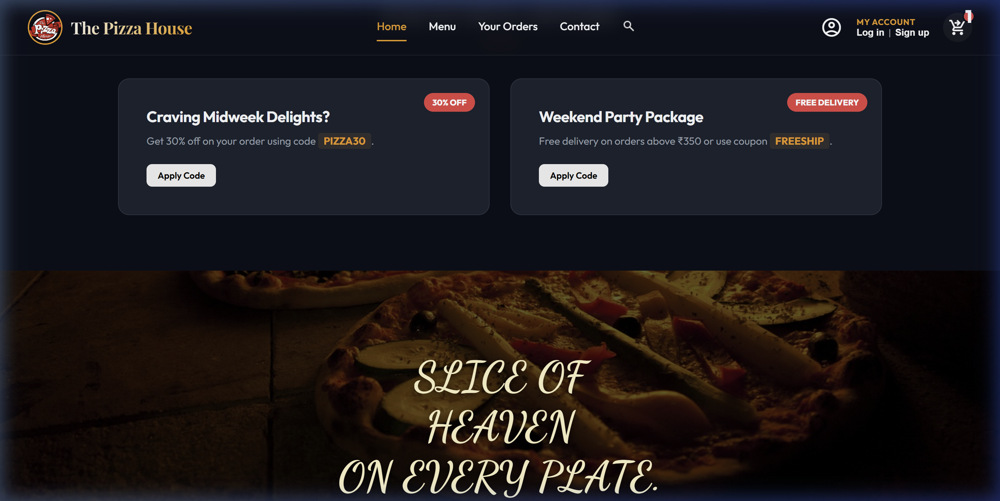
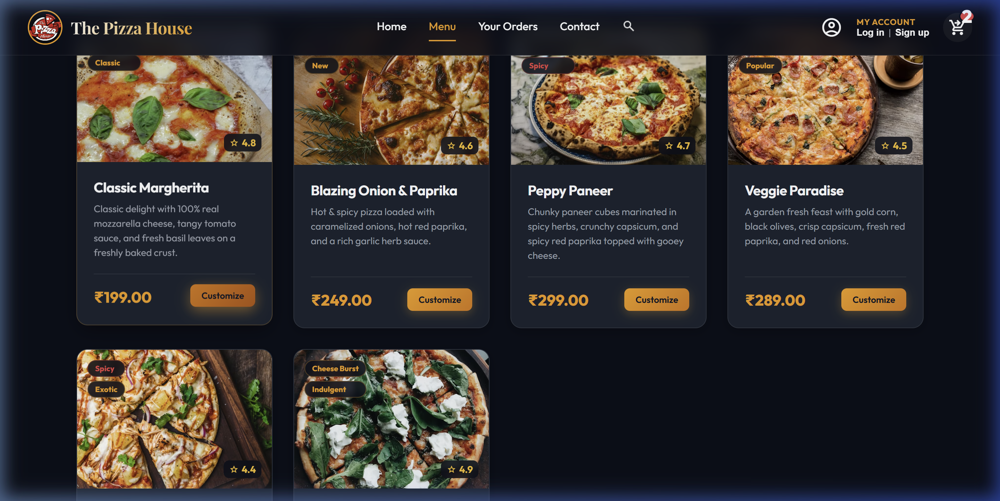
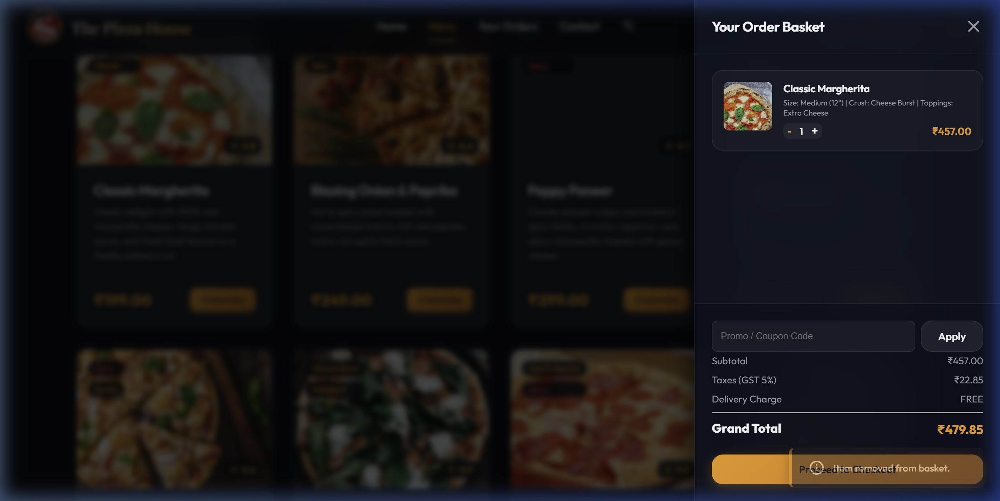
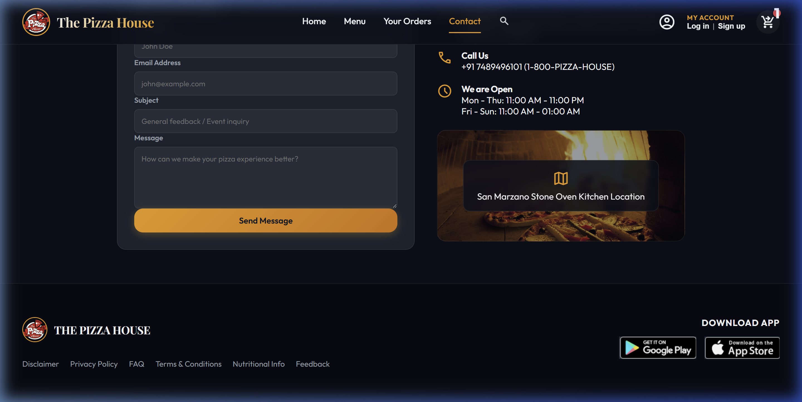

# 🍕 The Pizza House - Online Ordering & Delivery System

A premium, fully interactive Single Page Application (SPA) for ordering pizzas online, localized for Indian users with real-time calculations, customization modals, and status tracking. Built with high-fidelity HTML5, CSS3, and modern client-side JavaScript.

🚀 **Live Demo**: [Hosted on AWS Amplify](https://main.d34e9hjqwa36lk.amplifyapp.com/)

---

## ✨ Features

* 🗺️ **Local Routing (SPA)**: Smooth page changes (Home, Menu, Your Orders, Contact) without reloading, maintaining single-page state.
* 🍕 **Interactive Customizer Modal**: Choose pizza sizes (Personal, Medium, Large), crust types (Classic, Cheese Burst, Thin), and select extra toppings with real-time price additions.
* 🛍️ **Glassmorphism Cart Drawer**: Animated slide-out drawer showing active basket items, quantities, and item-specific customizations.
* 🧾 **Rupee-based Price Calculations**: Computes subtotals, GST (5% tax), delivery dues (₹40, free on orders above ₹350), coupon discounts, and final totals in Indian Rupees (₹).
* 🏷️ **Coupon Code Engine**: Supports dynamic promo code checks (e.g., `PIZZA30` for 30% off or `FREESHIP` for free shipping).
* 🛵 **Live Status Delivery Simulator**: Real-time visual timeline showing order states: `Order Placed` ➔ `Kitchen preparing` ➔ `Out for delivery` ➔ `Delivered!`. Simulated status updates automatically on timers.
* 🔐 **User Accounts System**: Persists profile sessions and registration databases using the browser's `localStorage` (so your account and order history are saved even when refreshing the page).
* 📱 **Fully Responsive Layout**: Premium mobile-responsive UI with glassmorphic drawers, hamburger menus, and animated slide-up toast alerts.

---

## 📸 Screenshots

Here is a visual showcase of the application:

### 1. Welcome Home Screen & Local Offers


### 2. Beautiful Pizza Customizer


### 3. Shopping Basket & Local Billing (₹)


### 4. Interactive Contact Section (Chennai Location)


---

## 🚀 How to Run Locally

Since this is a client-side driven application, there are **no complex backend installations or database servers to set up**!

### Option 1: Double-Click (File Explorer)
Simply double-click the `index.html` file to open and run it directly in any modern browser.

### Option 2: Local HTTP Server (Recommended)
To prevent local browser security limits from blocking font load assets, serve it using any simple local HTTP server:

**Using Python:**
```bash
python -m http.server 8000
```
Open [http://localhost:8000](http://localhost:8000) in your web browser.

**Using Node / npm:**
```bash
npx http-server -p 8000
```
Open [http://localhost:8000](http://localhost:8000) in your web browser.

### Option 3: Cloud Hosting (AWS Amplify)
The project is configured for continuous delivery on **AWS Amplify Hosting**. Pushing changes to the `main` branch of this GitHub repository will automatically trigger a rebuild and redeployment of the live website.
* **Live Site Link**: [The Pizza House Live Demo](https://main.d34e9hjqwa36lk.amplifyapp.com/)

---

## 🛠️ Technology Stack
* **Markup**: Semantic HTML5 structures
* **Styling**: Vanilla CSS3 (Custom design variables, keyframe animations, glassmorphism, flexbox/grid layouts)
* **Logic & State**: Modern Vanilla ES6 JavaScript (LocalStorage APIs, DOM elements state routers)